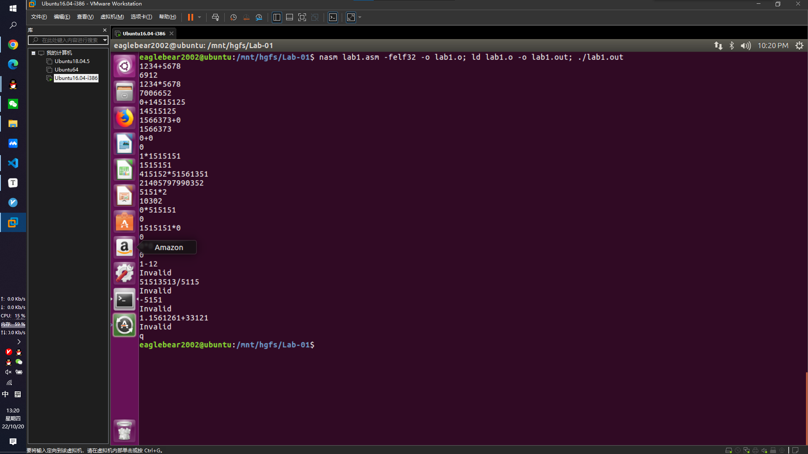
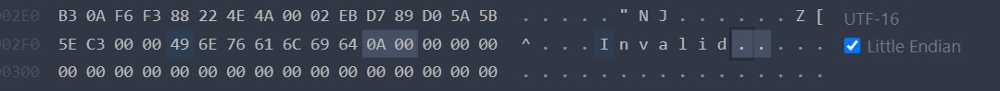

# 实验一-实验报告

## 实验任务一：Hello OS

### 实验环境

+ VMWare Workstation Pro 16
+ Ubuntu 16.04-i386

### `boot.asm` 文件

```asm
    org 07c00h             ; 告诉编译程序加载到 7c00 处
    mov ax, cs
    mov ds, ax
    mov es, ax
    call DispStr           ; 调用显示字符串例程
    jmp $                  ; 无限循环
DispStr:
    mov ax, BootMessage
    mov bp, ax             ; ES : BP = 串地址
    mov cx, 16             ; CX = 串长度
    mov ax, 01301h         ; AH = 13 , AL = 01h
    mov bx, 000ch          ; 页号为 0 (BH = 0) 黑底红字 (BL = 0Ch, 高亮)
    mov dl, 0	
    int 10h                ; 10h 号中断
    ret
BootMessage: db "Hello, OS World!" 
times 510-($-$$)    db 0   ; $-$$ 表示本行距离程序开始处的相对距离
                           ; 用 0 填充剩下的空间，使生成二进制恰好 512 字节
dw 0xaa55                  ; 结束标志
```

### `bochsrc` 文件

```
megs: 32
display_library: sdl
floppya: 1_44=a.img, status=inserted
boot: floppy
```

### 实验记录

```bash
eaglebear2002@ubuntu:~/Desktop$ nasm boot.asm -o boot.bin
eaglebear2002@ubuntu:~/Desktop$ bximage
========================================================================
                                bximage
                  Disk Image Creation Tool for Bochs
          $Id: bximage.c 11315 2012-08-05 18:13:38Z vruppert $
========================================================================

Do you want to create a floppy disk image or a hard disk image?
Please type hd or fd. [hd] fd

Choose the size of floppy disk image to create, in megabytes.
Please type 0.16, 0.18, 0.32, 0.36, 0.72, 1.2, 1.44, 1.68, 1.72, or 2.88.
 [1.44] 
I will create a floppy image with
  cyl=80
  heads=2
  sectors per track=18
  total sectors=2880
  total bytes=1474560

What should I name the image?
[a.img] 

The disk image 'a.img' already exists.  Are you sure you want to replace it?
Please type yes or no. [no] yes

Writing: [] Done.

I wrote 1474560 bytes to a.img.

The following line should appear in your bochsrc:
  floppya: image="a.img", status=inserted
eaglebear2002@ubuntu:~/Desktop$ dd if=boot.bin of=a.img bs=512 count=1 conv=notrunc
1+0 records in
1+0 records out
512 bytes copied, 0.000178427 s, 2.9 MB/s
eaglebear2002@ubuntu:~/Desktop$ bochs -f bochsrc
```

### 实验结果


### 实验困难

实验当中遇到问题：在共享文件夹 `/mnt/hgfs/Lab-01` 中，生成 `a.img` 文件并**写入内容**后使用 `vi -b a.img` 查看文件内容发现**文件内容为空**，并且一段时间后该文件会消失，推测是该文件在 Windows 系统中被识别为格式不对的图片并被自动删除以保护系统。该推测没有得到证实。

实验者将实验目录移动至虚拟机桌面后顺利完成了实验。

## 实验任务二：整数加法乘法

### 实现功能

1. 可以正确计算非负大整数加法
2. 可以正确计算非负大整数乘法
3. 输入 `q` 命令时退出程序
4. 对于缺少运算符等错误，输出 `Invalid` 报错信息并可以继续输入，程序不会崩溃

### 源代码

见文件 `lab1.asm`。

### 运行截图



## 实验提问

### 什么是复杂指令集？什么是精简指令集？80x86 采用的是哪种？

复杂指令集（Complex Instruction Set Computing，CISC），对 CPU 逻辑电路的设计要求高，简化了对编译器的要求，但是带来了 CPU 成本和功耗的增加。

精简指令集（Reduced Instruction Set Computing，RISC），通过多条简单指令拼凑一个复杂功能，对编译器优化要求高，但是功耗低，CPU 设计简单，主要用在端侧。

CISC 指令长度不固定，指令较多，这将导致指令切割复杂，通常需要切割未多个微操作码，然后执行计算。

RISC 指令长度固定，指令较少，指令码切割简单，这将更容易并行化，执行效率高。

80x86 采用的是复杂指令集。

### 什么是小端存储？什么是大端存储？80x86 采用的是哪种？

“大端”和“小端”表示多字节值的哪一端存储在该值的**起始地址处**；小端存储在起始地址处，即是小端字节序；大端存储在起始地址处，即是大端字节序。

+ 大端存储模式：数据的低位保存在内存中的高地址中，数据的高位保存在内存中的低地址中（从高位开始存储）
+ 小端存储模式：数据的低位保存在内存中的低地址中，数据的高位保存在内存中的高地址中（从低位开始存储）

80x86 是小端存储。

在实验代码中，该段数据定义及其在 ELF 文件中对应的十六进制表示如下：

```assembly
section .data
	errorMessage db "Invalid", 000Ah, 00h
```



### 8086 有哪5类寄存器？请分别举例说明其作用

1. 数据寄存器：AX（accumulator）、BX（base）、CX（counter）、DX
2. 指针寄存器：SP（堆栈指针）、BP（基数指针）
3. 变址寄存器：SI（源变址）、DI（目的变址）
4. 控制寄存器：IP（指令指针）、FLAG（状态标记）
5. 段寄存器：CS（代码段）、DS（数据段）、SS（堆栈段）、ES（附加段）

前三类称为通用寄存器。

### 有哪些段寄存器，它们的作用是什么？

系统中共有 4 个 16 位段寄存器，即代码段寄存器 CS、数据段寄存器 DS、堆栈段寄存器 SS 和附加段寄存器 ES。这些段寄存器的内容与有效的地址偏移量一起，可确定内存的物理地址。通常 CS 划定并控制程序区，DS 和 ES 控制数据区，SS 控制堆栈区。

### 什么是寻址？8086 有哪些寻址方式？

寻址方式是指寻找指令或操作数有效地址的方式，从而能够取出操作数或指令。

8086 有七种寻址方式：

1. 立即寻址：`mov ax 1234h`
2. 直接寻址：`mov ax [1234h]`
3. 寄存器寻址：`mov ax bx`
4. 寄存器间接寻址：`mov ax [bx]`，操作数有效地址在寄存器当中（SI、DI、BX、BP）
5. 寄存器相对寻址：`mov ax [si+3]`
6. 基址加变址寻址：`mov ax [bx+di]`，把一个基址寄存器（BX、BP）的内容，加上变址寄存器（SI、DI）的内容
7. 相对基址加变址寻址：`mov ax [bx+di+3]`

### 什么是直接寻址？直接寻址的缺点是什么？

直接寻址是一种基本的寻址方法，其特点是：在指令格式的地址的字段中**直接指出操作数在内存的地址**。由于操作数的地址直接给出而不需要经过某种变换，所以称这种寻址方式为直接寻址方式，如 `mov ax [add]`。

直接寻址的优点是简单，指令在执行阶段仅访问一次主存，不需要专门计算操作的地址；**缺点是 `add` 的位数决定了该指令操作数的寻址范围，操作数的地址不易修改**。

### 主程序与子程序之间如何传递参数？你的实验代码中在哪里体现的？

1. 利用寄存器传递参数：缺点是能传递的参数有限，因为寄存器有限
2. 利用约定的存储单元传递参数
3. 利用堆栈传递参数（常用）
4. 利用 CALL 后续区传递参数：CALL 后续区是指位于 CALL 指令后的存储区，主程序在调用子程序之前，把入口参数存入 CALL 指令后面的存储区，子程序根据保存在堆栈中的返回地址找到入口参数。由于这种方法把数据和代码混在一起，在 x86 系列中使用的不多

### 如何处理输入和输出？你的代码中在哪里体现的？

`getline` 函数调用系统中断，从键盘读入字符串；`puts` 函数使用调用系统中断，输出内容到屏幕。

其中 `eax` 表示中断调用号， `ebx, ecx, edx, esi, edi` 依次用于传参，最多传五个参数。

### 通过什么寄存器保存前一次的运算结果？你的代码中在哪里体现的？

见代码注释。

### 请分别简述 `MOV` 指令和 `LEA` 指令的用法和作用

传送指令 `MOV` 表示把一个字节、字或双字的操作数从源位置传送到目的位置，源操作数的内容不变。

加载有效地址指令 `LEA`（Load effective address） 指令实际上仅仅做寄存器和立即数的计算，并不真实访问内存，其载入的内存地址，仅仅是一个数值，并不需要对该内存地址有访问权限，该指令类似 C 语言取地址操作符 `&`。

### 解释 `boot.asm` 文件中 `org 07c00h` 的作用

`org 07c00h` 的作用：**告诉汇编器（而不是引导程序），当前这段代码会放在 07c00h 处**。所以，如果之后遇到需要绝对寻址的指令，那么绝对地址就是 07c00h 加上相对地址。在第一行加上 `org 07c00h` 只是让编译器从相对地址 07c00h 处开始编译第一条指令，相对地址被编译加载后就正好和绝对地址吻合。

如果删去这一行，装载进入内存时不会出错，但计算地址时会出错。

### 解释 `boot.asm` 文件中 `times 510-($-$$) db 0` 的作用

`$-$$` 可能会经常被用到，它表示本行距离程序开始处的相对距离。`times 510-($-$$) db 0` 的意思就是将 0 这个字节重复 `510-($-$$)` 遍，直到数据内容有 510B 为止。这样，加上结束标志 `0XAA55` 占用 2B，恰好是 512B。软盘、硬盘的最小粒度为扇区，每个扇区固定为 512 字节字节，所以我们要把程序加满到能填充一个扇区。

### 解释 `bochsrc` 中各参数的含义

+ `display_library`：Bochs 使用的 GUI 库
+ `megs`：虚拟机内存大小（MB）
+ `floppya`：虚拟机外设，软盘为 `a.img` ⽂件
+ `boot`：虚拟机启动方式，从软盘启动

### `boot.bin` 应该放在软盘的哪一个扇区？为什么？

`boot.bin` 需要放在软盘的第一个扇区。因为 BIOS 程序检查软盘 0 面 0 磁道 1 扇区，如果扇区以 `0xaa55` 结束，则认定为引导扇区，将其 512B 的数据加载到内存的 0x7c00 处，然后设置 PC，跳到内存 0x7c00 处开始执行代码。

### Loader 的作用有哪些？

1. 跳⼊保护模式：最开始的 x86 处理器 16 位，寄存器用 ax, bx 等表示，称为实模式。后来扩充成 32 位，eax，ebx 等，为了向前兼容，提出了保护模式。必须从实模式跳转到保护模式，才能访问 1M 以上的内存。

2. 启动内存分页。

3. 从 `kernel.bin` 中读取内核，并放入内存，然后跳转到内核所在的开始地址，运行内核 。跟 boot 类似，使用汇编直接在软盘下搜索 `kernel.bin`。但是，不能把整个 `kernel.bin` 放在内存，而是要以 ELF 文件的格式读取并提取代码。

## 参考文献

1. [【OSLab1】Nasm实现加减乘法](https://blog.csdn.net/m0_53632564/article/details/127089804)
2. [汇编——大数加法or 高精度加法_GreyBtfly王宝彤的博客](https://blog.csdn.net/GreyBtfly/article/details/80532904)
3. [x86汇编语言程序设计-长整数加法_AngelJisoo的博客 - CSDN](https://blog.csdn.net/AngelJisoo/article/details/109153670)
4. [汇编语言：大数乘法 - CSDN博客](https://blog.csdn.net/censorship/article/details/107123226)
5. [NASM Docs](https://www.nasm.us/doc/)